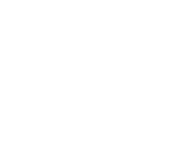

## Salve Mundi's website

In order to get started:

Install [NPM/NodeJS](https://nodejs.org/en/) and [Composer](https://getcomposer.org/download/)

Set up a database. You can use something like [XAMPP](https://www.apachefriends.org/index.html) to accomplish this, or read down below for
instructions on setting up a local development environment using Docker. Create a database, and add a user that has full access to that database.
PHP-8.0 is officially supported.

Create an environment (`.env`) file. The example `.env.example` file should get you along the way. To generate a key to be used for encrypting and
decrypting data, run the following command in your terminal:
> php artisan key:generate

In order to start up the project run the following inside the project root directory:

1. `$ composer install`
2. `$ npm install`
3. `$ npm run dev` or `$ npm run watch` (second option automatically re-compiles css when altering css/scss files)
4. `$ php artisan storage:link`
5. `$ php artisan migrate`
6. `$ php artisan db:seed`
7. `$ php artisan serve`

If you are using Docker, step 4,5,6 & 7 can be ignored.

# Docker

If you don't want to run a webserver and database on your own computer you can also use [Docker](https://docs.docker.com/get-docker/). I have made a
Dockerfile that you will have to build first. Before starting up docker, make sure that the database host is set to `db` in your .env file.

## Method 1 - Laravel Sail

If you have Docker installed on your machine, you may use [Laravel Sail](https://laravel.com/docs/8.x/sail) to run various Docker containers for local
development. By default, port 80 is used for the web server, making the application reachable on `http://localhost` in your browser.

Commands:

- `./vendor/bin/sail up -d`
  - Starts the services defined in `docker-compose.yml`

- `./vendor/bin/sail down`
  - Stops the aforementioned services

To run Artisan commands, use `./vendor/bin/sail artisan`. For more information, view
the [Sail documentation](https://laravel.com/docs/8.x/sail#executing-sail-commands).

### Setting up

First, start the services by running `./vendor/bin/sail up -d`. Migrate the database by running `./vendor/bin/sail artisan migrate` and finally seed
the database by running `
./vendor/bin/sail artisan db:seed`.

## Method 2 - Manually

If for some reason you are using Windows, make sure the `docker-start.sh` file is executable. When still getting permission denied errors
for `docker-start.sh` then you may also set the permission correctly inside the docker-container.
- `$ docker exec -it app bash`
- `$ chmod +X docker-start.sh`

After that is done `$ docker-compose up -d` can be run and should work fine from here on. If not, please also read the [APIs](#APIs) segment.

That will start up the project's containers, however this may take a while due to database seeding.

# APIs

## Microsoft graph

We are using [Microsoft Graph](https://docs.microsoft.com/en-us/graph/), therefore we have API tokens.
Meaning that a lot of functionality of the site is broken if you don't have Microsoft Graph api tokens.
However, if you are a part of the IT-commission of Salve Mundi we will trust you with these tokens.
Keep in mind that we are dealing with personal data, and the website should comply with GDPR.
P.S yes we shouldn't use production data in development but Microsoft Graph does not provide public test data via their API at this time.

## Mollie

As for our payment system, [Mollie](https://mollie.com). This api key is only available to the development server. Reason being since Mollie uses
webhooks in order to communicate payment status updates, the host sending the payment request needs to publicly available. Therefore, you can't test
mollie payments from your localhost under default circumstances.

---

PS. Please don't commit sensitive/personal data into this public repo :)

Thanks for reading!

Made by: The IT Committee of Salve Mundi
